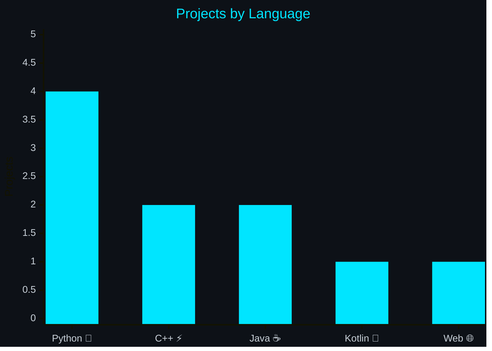

<!-- ╔══════════════════════════════════════════════════════════════════╗ -->
<!-- ║        MUHAMMAD SHAH NAWAZ — GitHub Profile README              ║ -->
<!-- ║        username: mshahnawaz1202                                 ║ -->
<!-- ╚══════════════════════════════════════════════════════════════════╝ -->

<!-- ━━━━━━━━━━━━━━━━━━━━━━━━━━━━━━━━━━━━━━━━━━━━━━━━━━━━━━━━━━━━━━━━━ -->
<!--  HEADER                                                           -->
<!-- ━━━━━━━━━━━━━━━━━━━━━━━━━━━━━━━━━━━━━━━━━━━━━━━━━━━━━━━━━━━━━━━━━ -->

<div align="center">


<br/>

[](https://git.io/typing-svg)

<br/>

<!-- Social Buttons -->
<a href="https://linkedin.com/in/muhammad-shah-nawaz-491701340" target="_blank">
  
</a>
<a href="https://instagram.com/m.shahnawaz_1202" target="_blank">
  
</a>
<a href="https://github.com/mshahnawaz1202" target="_blank">
  
</a>

<br/><br/>


</div>


<!-- ━━━━━━━━━━━━━━━━━━━━━━━━━━━━━━━━━━━━━━━━━━━━━━━━━━━━━━━━━━━━━━━━━ -->
<!--  ABOUT ME                                                         -->
<!-- ━━━━━━━━━━━━━━━━━━━━━━━━━━━━━━━━━━━━━━━━━━━━━━━━━━━━━━━━━━━━━━━━━ -->

## `〉 about me`

<table>
<tr>
<td valign="top" width="58%">

Software Engineering student focused on turning complex problems into elegant, scalable solutions. From low-level system logic to rich interactive interfaces — I build software that matters.

```yaml
name        : Muhammad Shah Nawaz
handle      : mshahnawaz1202
location    : Pakistan 🇵🇰
linkedin    : in/muhammad-shah-nawaz-491701340
instagram   : @m.shahnawaz_1202
repos       : 33 public repositories
interests   :
  - Scalable Systems & OOP / SOLID
  - Native Android with Kotlin
  - AI, Data & Predictive Modelling
  - Software Testing & Automation
```

</td>
<td valign="top" width="42%">

**What I focus on:**

&nbsp;&nbsp;◈ &nbsp;**Architecture** — Scalable systems with OOP & SOLID  
&nbsp;&nbsp;◈ &nbsp;**Mobile** — Native Android with Kotlin  
&nbsp;&nbsp;◈ &nbsp;**AI & Data** — Predictive models & smart dashboards  
&nbsp;&nbsp;◈ &nbsp;**Testing** — Automated QA with Selenium & TestOps  
&nbsp;&nbsp;◈ &nbsp;**Design** — UI/UX prototyping in Figma  
&nbsp;&nbsp;◈ &nbsp;**Agile** — Sprint planning & version control  

<br/>

> *"Code is poetry written for machines, read by humans."*

</td>
</tr>
</table>


<!-- ━━━━━━━━━━━━━━━━━━━━━━━━━━━━━━━━━━━━━━━━━━━━━━━━━━━━━━━━━━━━━━━━━ -->
<!--  SOFTWARE ENGINEERING CORE                                        -->
<!-- ━━━━━━━━━━━━━━━━━━━━━━━━━━━━━━━━━━━━━━━━━━━━━━━━━━━━━━━━━━━━━━━━━ -->

## `〉 software engineering`

<div align="center">

| Phase | Focus |
|:---|:---|
| 📋 **Analysis & Design** | Requirements refinement, system architecture, UI/UX modelling with Figma & UML |
| 💻 **Development** | Clean, documented, maintainable systems using modern design patterns |
| 🧪 **Testing & QA** | Software reliability through automated testing frameworks — Selenium, TestOps |
| 🚀 **Management** | Agile sprint planning, version control, and seamless deployment workflows |

</div>


<!-- ━━━━━━━━━━━━━━━━━━━━━━━━━━━━━━━━━━━━━━━━━━━━━━━━━━━━━━━━━━━━━━━━━ -->
<!--  GITHUB ACHIEVEMENTS                                              -->
<!-- ━━━━━━━━━━━━━━━━━━━━━━━━━━━━━━━━━━━━━━━━━━━━━━━━━━━━━━━━━━━━━━━━━ -->

## `〉 achievements`

<div align="center">

| 🏅 Badge | Description |
|:---:|:---|
| **Pull Shark** | Opened pull requests that got merged |
| **Quickdraw** | Closed an issue or PR within 5 minutes of opening |
| **YOLO** | Merged a PR without a code review |

<br/>

[](https://github.com/mshahnawaz1202)

</div>


<!-- ━━━━━━━━━━━━━━━━━━━━━━━━━━━━━━━━━━━━━━━━━━━━━━━━━━━━━━━━━━━━━━━━━ -->
<!--  FEATURED PROJECTS                                                -->
<!-- ━━━━━━━━━━━━━━━━━━━━━━━━━━━━━━━━━━━━━━━━━━━━━━━━━━━━━━━━━━━━━━━━━ -->

## `〉 featured projects`

<div align="center">

<table>
<tr>

<!-- PROJECT 1 -->
<td valign="top" width="50%">

<h3 align="center">AI Data Analysis Dashboard</h3>
<p align="center">
  <a href="https://github.com/mshahnawaz1202/-AI-Data-Analysis-Prediction-Dashboard">
    
  </a>
</p>

> Full Streamlit dashboard with data upload, cleaning, statistics, visualisations, ML predictions, and an AI chat insights layer.

<p>
  
  
  
  
</p>

⭐ 1 star

</td>

<!-- PROJECT 2 -->
<td valign="top" width="50%">

<h3 align="center">Jarvis AI Assistant</h3>
<p align="center">
  <a href="https://github.com/mshahnawaz1202/Jarvis">
    
  </a>
</p>

> A voice-based desktop AI assistant. Listens, understands, and responds — a personal Jarvis built from the ground up.

<p>
  
  
  
</p>

</td>

</tr>
<tr>

<!-- PROJECT 3 -->
<td valign="top" width="50%">

<h3 align="center">TestOps Automation Framework</h3>
<p align="center">
  <a href="https://github.com/mshahnawaz1202/TestOps-andAutomation-Framework">
    
  </a>
</p>

> End-to-end test automation framework built with Selenium and Java, following TestOps principles for continuous quality.

<p>
  
  
  
</p>

</td>

<!-- PROJECT 4 -->
<td valign="top" width="50%">

<h3 align="center">Mini Operating System</h3>
<p align="center">
  <a href="https://github.com/mshahnawaz1202/Mini-Operating-System">
    
  </a>
</p>

> A simulated mini OS built in C++. Explores process management, scheduling, and low-level system logic.

<p>
  
  
</p>

</td>

</tr>
<tr>

<!-- PROJECT 5 -->
<td valign="top" width="50%">

<h3 align="center">Mini Instagram</h3>
<p align="center">
  <a href="https://github.com/mshahnawaz1202/Mini-Instagram">
    
  </a>
</p>

> A simplified Instagram-like social platform built in C++, featuring core social mechanics and OOP architecture.

<p>
  
  
</p>

</td>

<!-- PROJECT 6 -->
<td valign="top" width="50%">

<h3 align="center">Arabic Poetry Manager</h3>
<p align="center">
  <a href="https://github.com/mshahnawaz1202/Arabic-Poetry-Management-System">
    
  </a>
</p>

> A full-stack desktop application for managing Arabic poetry records, with a JavaFX UI and MySQL backend.

<p>
  
  
  
</p>

</td>

</tr>
</table>

<details>
<summary><b>+ More Projects</b></summary>
<br/>

| Project | Stack | Link |
|:---|:---|:---|
| 🎲 Ludo Gold | Python, Pygame | [View →](https://github.com/mshahnawaz1202/Ludo-Gmae-In-Python) |

</details>

</div>


<!-- ━━━━━━━━━━━━━━━━━━━━━━━━━━━━━━━━━━━━━━━━━━━━━━━━━━━━━━━━━━━━━━━━━ -->
<!--  TECH STACK                                                       -->
<!-- ━━━━━━━━━━━━━━━━━━━━━━━━━━━━━━━━━━━━━━━━━━━━━━━━━━━━━━━━━━━━━━━━━ -->

## `〉 tech stack`

<details open>
<summary><b>Languages</b></summary>
<br/>


</details>

<details>
<summary><b>Frameworks & Databases</b></summary>
<br/>


</details>

<details>
<summary><b>AI & Data</b></summary>
<br/>


</details>

<details>
<summary><b>Design & DevTools</b></summary>
<br/>


</details>


<!-- ━━━━━━━━━━━━━━━━━━━━━━━━━━━━━━━━━━━━━━━━━━━━━━━━━━━━━━━━━━━━━━━━━ -->
<!--  PROJECT LANGUAGE DISTRIBUTION                                    -->
<!-- ━━━━━━━━━━━━━━━━━━━━━━━━━━━━━━━━━━━━━━━━━━━━━━━━━━━━━━━━━━━━━━━━━ -->

## `〉 project distribution`

<div align="center">



</div>


<!-- ━━━━━━━━━━━━━━━━━━━━━━━━━━━━━━━━━━━━━━━━━━━━━━━━━━━━━━━━━━━━━━━━━ -->
<!--  GITHUB STATS                                                     -->
<!-- ━━━━━━━━━━━━━━━━━━━━━━━━━━━━━━━━━━━━━━━━━━━━━━━━━━━━━━━━━━━━━━━━━ -->

## `〉 github stats`

<div align="center">


<br/><br/>


<br/><br/>

<!-- Activity Graph -->


</div>

<br/>

<!-- Contribution Snake -->
<div align="center">
  <picture>
    <source media="(prefers-color-scheme: dark)" srcset="https://raw.githubusercontent.com/mshahnawaz1202/mshahnawaz1202/output/github-contribution-grid-snake-dark.svg"/>
    <source media="(prefers-color-scheme: light)" srcset="https://raw.githubusercontent.com/mshahnawaz1202/mshahnawaz1202/output/github-contribution-grid-snake.svg"/>
    
  </picture>
</div>


<!-- ━━━━━━━━━━━━━━━━━━━━━━━━━━━━━━━━━━━━━━━━━━━━━━━━━━━━━━━━━━━━━━━━━ -->
<!--  CONNECT                                                          -->
<!-- ━━━━━━━━━━━━━━━━━━━━━━━━━━━━━━━━━━━━━━━━━━━━━━━━━━━━━━━━━━━━━━━━━ -->

## `〉 connect`

<div align="center">

I'm open to collaborations, internships, and interesting projects.

<br/>

<a href="https://linkedin.com/in/muhammad-shah-nawaz-491701340" target="_blank">
  
</a>
&nbsp;
<a href="https://instagram.com/m.shahnawaz_1202" target="_blank">
  
</a>
&nbsp;
<a href="https://github.com/mshahnawaz1202" target="_blank">
  
</a>

</div>

<!-- ━━━━━━━━━━━━━━━━━━━━━━━━━━━━━━━━━━━━━━━━━━━━━━━━━━━━━━━━━━━━━━━━━ -->
<!--  FOOTER                                                           -->
<!-- ━━━━━━━━━━━━━━━━━━━━━━━━━━━━━━━━━━━━━━━━━━━━━━━━━━━━━━━━━━━━━━━━━ -->

<br/>


<div align="center">
  <sub>Pakistan 🇵🇰 · mshahnawaz1202 · Developer. Learner. Builder.</sub>
</div>
